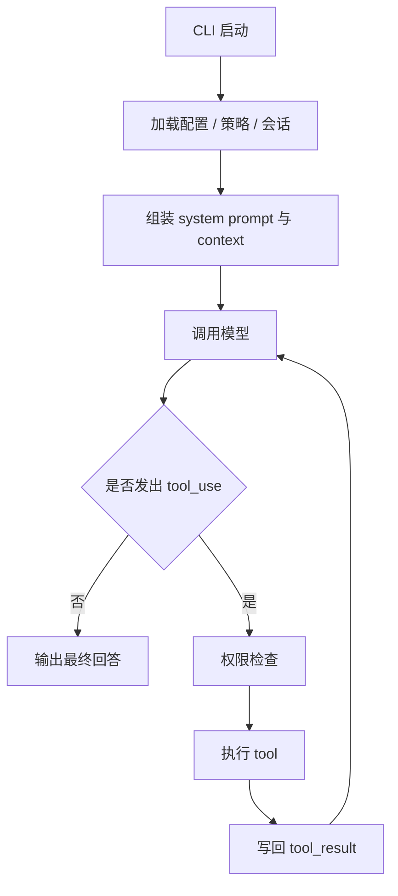
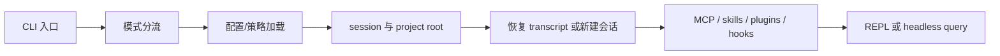
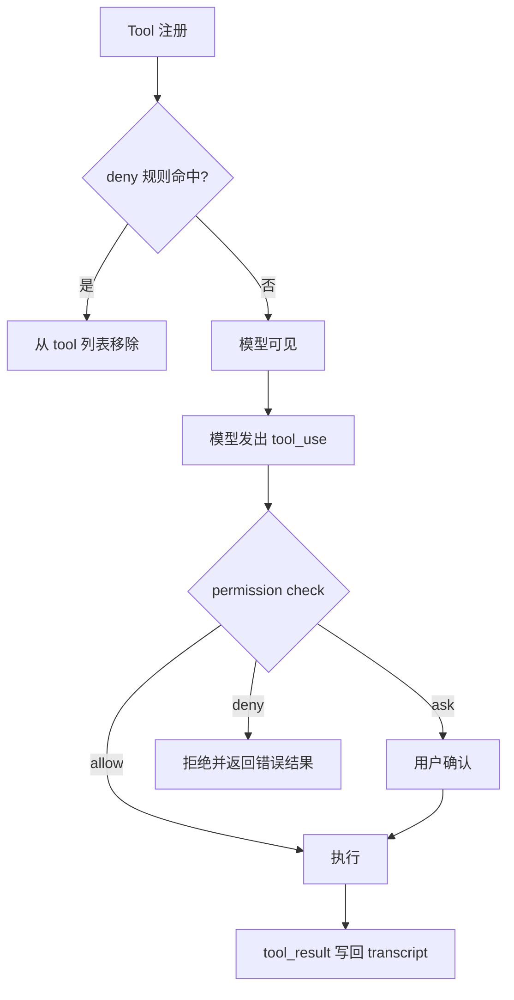
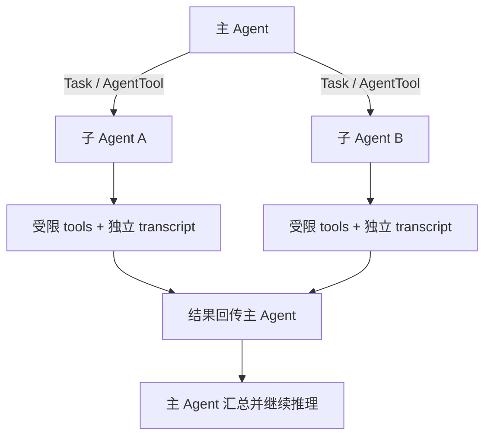

---

layout: post
tags: [LLM, Agent, Engineering]
title: Claude Code 如何工作
date: 2026-04-01
author: Kyrie Chen
comments: true
toc: true
pinned: false

---

最近把一份 Claude Code 源码快照系统过了一遍，最大的感受是：它并不是一个“会调几个工具的 CLI”，也不只是一个“把大模型接进终端”的聊天程序。更准确地说，它是一个运行在终端里的 **agent runtime**。

很多人第一次用 Claude Code，会把体验归因于模型本身。但从代码实现看，真正决定它是否稳定、是否可控、是否能持续跑长任务的，主要不是模型，而是外围这套运行时工程：启动怎么分流、上下文怎么拼、memory 怎么分层、tool 怎样注册和裁剪、权限如何 fail-closed、长对话如何压缩恢复、子 agent 如何委派和回收。

所以这篇文章不再按官方文档目录去复述功能，而是换一个更接近实现的视角：**Claude Code 到底是如何被拉起来、如何驱动一次对话、又如何把单次 tool calling 扩展成一个长期运行的 coding agent。**

## 先给结论

如果只看表面，Claude Code 很像“终端里的 ChatGPT + shell + 文件编辑”。但从架构上看，它至少由四个彼此耦合的内核组成：

1. **启动内核**：负责解析 CLI、配置、策略、信任关系、会话恢复、远程模式，把整个 runtime 拉起来。
2. **对话内核**：负责组装 prompt、context、messages，驱动 `模型 -> tool -> 模型` 的循环。
3. **工具内核**：负责工具协议、权限检查、并发执行、结果截断、落盘和 transcript 映射。
4. **Agent 内核**：负责把“Claude 自己干活”扩展成“Claude 调度多个 worker/sub-agent 协同干活”。

UI、MCP、skills、plugins、hooks 这些东西当然也重要，但它们更多是围绕这四个内核展开的扩展层。理解了这四层，Claude Code 的大部分行为都能解释清楚。

## 它首先不是 IDE 插件，而是 terminal-native runtime

Claude Code 的基本定位很直接：它默认就运行在你的终端里，直接面对你的代码仓库、本地 shell、git 状态和开发环境。

这件事看起来只是“交互界面不同”，但实际影响很大。因为一旦终端是第一现场，系统就必须认真处理下面这些问题：

- 当前工作目录是谁
- 项目根目录怎么发现
- 当前 git 分支和工作区状态要不要注入 prompt
- 哪些文件能读，哪些文件能写
- 哪些命令可以自动执行，哪些必须确认
- 长任务怎样后台运行
- 对话怎样恢复，历史怎样压缩
- 项目规则怎样随着目录变化自动生效

换句话说，Claude Code 从一开始就不是“先做个聊天框，再给它接几个工具”，而是围绕一个真实开发环境去设计的。

## Claude Code 的主链路

把很多实现细节收起来后，Claude Code 的主链路其实很清楚：

这条链路看上去很普通，很多 agent 产品也都能画出类似图。但 Claude Code 的关键不在“有没有这个 loop”，而在它把 loop 周围几乎每个环节都做成了独立、可恢复、可裁剪、可审计的运行时部件。

## 从启动到对话：Claude Code 先把 runtime 组装好

Claude Code 真正复杂的地方，往往发生在第一条 prompt 之前。很多人会把 `query.ts` 视为核心，这当然没错，但只看这一层很容易低估系统复杂度。

启动阶段大致要完成这些事：

- 解析当前是交互模式、非交互模式、远程模式，还是某种 fast path
- 加载 settings、managed settings、feature flags、迁移逻辑
- 建立 session id、工作目录、project root、会话存储
- 恢复已有 transcript，或者创建新会话
- 初始化 hooks、watcher、plugin、MCP、skills 等外围能力
- 根据模式决定是否进入 REPL，还是直接跑一次 headless query

可以把它理解成一套很轻的“runtime 上电流程”：

用户看到 prompt 的那一刻，Claude Code 其实已经完成了相当多的环境铺设。如果启动期不把上下文、配置和运行边界整理干净，后面的 agent loop 再漂亮也很难稳定。

## 对话内核：真正的核心不是聊天，而是可恢复的状态机

Claude Code 的主循环可以概括成一句话：**把一次用户请求变成一连串合法的模型回合和工具回合。**

它通常这样运行：

1. 用户输入消息，或通过 `--print` / stdin 提供一次性任务。
2. 系统组装当前消息列表、system prompt、tool 列表、memory、git 状态和日期。
3. 请求模型，流式接收输出。
4. 如果模型发出 `tool_use`，运行对应工具并将结果写回消息流。
5. 模型继续消费这些 `tool_result`，决定是否还要调用更多工具。
6. 当某个回合不再有工具调用时，输出最终答复。

这里最重要的一点是：Claude Code 维护的不是一个简单的 request-response 流程，而是一个 **可流式、可中断、可恢复、可压缩的对话状态机**。

它为什么复杂？因为它要同时满足这些约束：

- 模型的 thinking / tool_use / tool_result 协议必须合法
- 工具可以在流式输出期间提前启动
- 用户可能在中途打断
- 长上下文需要及时压缩
- fallback 发生时旧工具结果不能污染新回合
- transcript 必须保持一致，方便 resume

这也是为什么 `query.ts` 这类文件往往很大。它承载的不是“业务逻辑”，而是 runtime correctness。

## Context 不是附属品，而是执行内核的一部分

很多人会把 agent 的“上下文”理解成一段 prompt，再加几段历史消息。但在 Claude Code 里，context 明显是运行时的一部分。

每次对话，系统通常都会注入两类信息：

- **system context**：当前日期、git 分支、默认分支、最近提交、工作区状态等
- **user context**：各种层级的 `CLAUDE.md`、项目规则、用户偏好、本地覆盖

这些内容不是随手拼进去的文案，而是决定模型行为边界的重要输入。

### Git 信息为什么重要

Claude Code 会把当前仓库的 git 状态注入到上下文里，包括分支、工作区变更、最近提交等。这样做的意义并不只是“让模型知道你在哪个分支上”，更重要的是让它知道：

- 当前是否有未提交改动
- 改动大致集中在哪些文件
- 最近的提交在做什么
- 现在这次任务更像是修补还是重构

对一个 coding agent 来说，这类环境信号远比一般聊天机器人常见的“角色设定”更有价值。

### `CLAUDE.md` 为什么是 Claude Code 的关键设计

Claude Code 的 memory 系统并不花哨，本质上就是一组普通 Markdown 文件。但它的设计非常有效，因为它把“长期指令”从对话中剥离出来，放回了文件系统层。

常见层级大致是：

| 层级 | 典型位置 | 用途 |
| --- | --- | --- |
| Managed memory | `/etc/claude-code/CLAUDE.md` | 组织级策略、安全约束 |
| User memory | `~/.claude/CLAUDE.md` | 用户级偏好，跨项目生效 |
| Project memory | 项目里的 `CLAUDE.md` / `.claude/rules/*.md` | 团队共享规范、命令、架构说明 |
| Local memory | `CLAUDE.local.md` | 只在本地生效的个人覆盖 |

它的关键不是“支持多层配置”，而是把不同范围的知识区分开了：

- 团队共享的规则，应该进仓库
- 个人习惯，不该污染仓库
- 本地路径、私有凭据提示，不该被提交
- 组织级安全策略，不该由项目随意覆盖

这套机制解决的是 agent 产品最常见的长期问题：**同一个模型，怎么在不同项目里持续表现得像“懂这个仓库的人”。**

### `@include` 和规则拆分的价值

Claude Code 允许在 memory 文件里用 `@` 引入其他文件，也支持 `.claude/rules/*.md` 这类规则目录。这样做的好处很直接：

- 避免一个 `CLAUDE.md` 变成难以维护的大杂烩
- 可以按领域拆规则，比如测试、风格、git 流程、目录约束
- 可以通过路径匹配，让某些规则只在操作特定目录时注入

本质上，这是一种非常实用的 prompt modularization。它没有引入复杂 DSL，却已经足够支撑大型仓库。

## Tool 内核：Claude Code 的工具不是函数，而是 capability

如果只从用户视角看，Claude Code 提供的无非是 `Read`、`Edit`、`Bash`、`Grep`、`WebFetch`、`Task` 这些工具。但从实现上看，tool 在这里的抽象级别远高于“一个可调用函数”。

一个 tool 通常不只包含调用逻辑，还包含：

- 输入和输出 schema
- 面向模型的描述文本
- 权限检查逻辑
- 是否只读
- 是否 destructive
- 是否允许并发
- 如何在 UI 里展示进度和结果
- 如何写入 transcript 与 telemetry

所以更准确的说法是：Claude Code 暴露给模型的不是一组函数，而是一组带有安全语义和执行语义的 **runtime capability**。

### 为什么 `Read`、`Edit`、`Write` 的设计很保守

Claude Code 的文件工具看起来朴素，但很多细节都在服务一个目标：尽量减少错误修改。

比如：

- `Read` 默认是结构化、带行号的读取
- `Edit` 倾向于做精确替换，而且要求 `old_string` 唯一命中
- 修改已有文件前，通常要求先读后写
- `Write` 更适合新建文件或整文件重写，而不是随意覆盖

这类约束表面上会让工具显得“不够自由”，但它实际换来了更高的稳定性。因为对 agent 来说，最危险的不是不会改，而是“改错位置还以为自己改对了”。

### 为什么 `Bash` 必须被单独看待

`Bash` 是 Claude Code 最强也最危险的工具，因为它不只是“运行命令”，而是直接拿到了一个持久 shell session。

这意味着：

- 工作目录变化会延续
- 环境变量变化会延续
- 后台任务可以继续存在
- 一个命令的副作用会影响后续命令

也就是说，`Bash` 不是 stateless tool，而是一个带环境状态的执行入口。所以 Claude Code 会对它做更严格的权限判断、复合命令拆解和特殊安全检查。

### 工具并发不是执行器拍脑袋决定的

Claude Code 的工具执行不是简单串行。它会根据工具声明的并发安全属性，把一批工具拆成：

- 可以并发的批次
- 必须独占串行的工具

这个设计很重要，因为它把“能否并发”从执行器的外部猜测，变成了工具协议自身的一部分。对 agent runtime 来说，这是正确的设计：并发安全应该由 capability 本身声明，而不是由调度器随便假设。

### Tool result 为什么要截断、落盘和消息化

工具输出如果不受控，非常容易把上下文窗口撑爆。Claude Code 的做法通常是：

- 对大结果截断，只把预览放进上下文
- 把完整结果存到临时文件或 side storage
- 把结果作为规范化的 `tool_result` 节点写回 transcript

这说明 tool output 在 Claude Code 里不是“顺便打印一下 stdout”，而是消息系统里的正式对象。它既要被模型继续消费，也要能在会话恢复时保持一致。

## Permission 是 Claude Code 真正的底座

如果说 `query.ts` 是运行引擎，permission system 就是 Claude Code 最重要的安全底座。

Claude Code 的一个根本前提是：它跑在本地真实环境里，能读文件、改文件、跑 shell、访问网络、调用外部 MCP 工具。只要权限系统做得不扎实，整个产品就不可能放心使用。

### 权限判断不是“要么允许，要么拒绝”这么简单

在 Claude Code 里，一次工具调用的权限结果通常不是简单布尔值，而更像：

- `allow`
- `ask`
- `deny`

必要时还会附带原因、修改后的输入或额外上下文。也就是说，权限系统不是外挂，而是工具执行链路的一部分。

### 它至少有两层防线

Claude Code 的权限控制至少分两层：

**第一层：prompt 前过滤。**

如果某些工具已经被 deny 规则整体禁用，它们甚至不会出现在模型可见的 tool 列表里。这个设计很关键，因为它不是“先让模型知道，再在调用时报错”，而是从一开始就缩小模型的可见能力面。

**第二层：调用时检查。**

即使工具已经暴露给模型，每次调用仍然要做权限判断，决定是自动执行、弹确认框，还是直接拒绝。

这种双层设计比单纯的“调用时拦截”更稳妥。

权限链路可以简化成下面这样：

### 权限模式的真实意义

无论界面上怎么命名，几种常见 mode 的本质都是在定义默认风险姿态：

- `default`：默认谨慎，对有副作用的操作要求确认
- `acceptEdits`：放宽文件修改，但保留命令审查
- `plan`：只读分析，不允许实际改动
- `bypassPermissions` / `dontAsk`：面向自动化场景，尽量少交互

这里最值得注意的是 `plan`。它本质上不是一个“功能模式”，而是一个非常实用的风控模式：先让 agent 读和想，但不让它动手。对陌生仓库、复杂改动、危险重构都很有价值。

### 为什么 Claude Code 值得借鉴

Claude Code 的权限设计有两个明显优点：

- **默认保守**：如果没有明确声明，系统倾向于不自动放权。
- **精细规则优先于粗暴模式切换**：允许 `Bash(git *)` 往往比直接进入 `bypassPermissions` 更合理。

这其实就是典型的 fail-closed 思路。对运行在本地的 agent 来说，这是比“尽量智能”更重要的事情。

## Agent 内核：它不是单智能体，而是可委派的多 agent runtime

Claude Code 很有意思的一点是：子 agent 不是外挂，也不是框架外另起一个调度器，而是被当作一种正式 tool 暴露给主模型。

这带来两个直接结果：

1. “要不要委派”本身成了模型可以推理的能力。
2. 子 agent 和普通工具共享同一套 transcript、progress、permission 和 telemetry 机制。

这是一种很强的一致性设计。

### Sub-agent 的本质是什么

当 Claude Code 通过 `Task` 之类的能力启动 sub-agent 时，本质上是在当前 runtime 里再实例化一次 query engine，只不过这次会带上：

- 新的上下文边界
- 新的 tool allowlist / denylist
- 独立的 transcript
- 不同的任务包装器
- 必要时不同的模型或远程运行策略

所以 sub-agent 不是“帮主 agent 开个线程”，而是“在同一套协议下再起一个受限 agent runtime”。

### 为什么这比普通 tool calling 更进一步

普通 tool calling 的模式通常是：模型调用工具，工具返回结果，模型继续推理。Claude Code 再往前走了一步，它允许工具本身就是另一个 agent。

这意味着主 agent 可以把任务拆成：

- 搜索型子任务
- 规划型子任务
- 验证型子任务
- 并行探索多个候选方案

也正因为如此，Claude Code 更接近一个 **coordinator + workers** 结构，而不是单模型配一组工具。

这层关系也可以画得更直白一点：

## 其他几层为什么能自然接进来

前面四个内核立住之后，UI、MCP、skills、plugins 这些外围层之所以不会显得拼凑，是因为它们接入的是稳定的 runtime 插槽，而不是某个临时页面或某段特例逻辑。

先看 UI。如果只从架构图上看，UI 似乎不是重点。但实际读代码会发现，Claude Code 的 REPL 非常重，因为它承担的不是“把文本打印出来”这么简单。

REPL 通常还要处理：

- 流式输出
- permission dialog
- tool progress
- 任务列表与切换
- 后台任务通知
- 远程会话状态
- 消息滚动与恢复
- slash commands

这说明它的 UI 更像“终端中的会话操作系统”，而不是传统意义上的命令行皮肤。也因此，Claude Code 会对终端渲染层做很多定制，而不是只把上游 Ink 当成一个普通 UI 库来用。

再看扩展层。MCP、skills、plugins 能接得很自然，是因为它们本质上都在复用同一套能力协议、上下文装配方式和会话机制。

### MCP 不是“多几个外部工具”那么简单

MCP 在 Claude Code 里承担的远不只是 tool 扩展。它还可能提供：

- tools
- resources
- prompts
- 认证入口

也就是说，MCP 更像 Claude Code 的外接总线，而不是孤立的插件接口。

### skill 本质上是高层行为封装

从实现视角看，skill 并不只是几段提示词。它更像对 agent 行为的高层封装：有些 skill 可以内联到当前会话，有些则更适合 fork 到独立 agent 里执行。

这就解释了为什么 Claude Code 的扩展能力不会显得拼凑。因为它的底层本来就是按“能力协议”组织的。

## 把整条链路重新看一遍

把前面这些部件串起来，一次典型请求的实际过程大概是这样的：

1. 你在终端输入一个任务。
2. 启动内核确认当前 session、cwd、配置、权限模式和可用工具。
3. 对话内核组装 system prompt、git 状态、`CLAUDE.md`、历史消息和 tool 列表。
4. 模型开始流式输出，必要时发出 `tool_use`。
5. 工具内核先做权限判断，再按并发规则执行工具。
6. 工具结果被截断、格式化、写入 transcript，再返回模型。
7. 如果任务过大，主 agent 可能再委派 sub-agent 继续跑子任务。
8. 整个过程中的消息、进度、权限决策和任务状态都同步到 REPL。
9. 对话过长时，系统压缩早期上下文，但保留完整 transcript 以便恢复。
10. 任务结束后，会话仍可继续，也可以在之后通过 `resume` 重新拉起。

从这个角度看，Claude Code 的核心竞争力不是“它会不会调用工具”，而是：**它把一个会调用工具的大模型，做成了一个能在真实开发环境里长期运行的工程系统。**

## 为什么 Claude Code 看起来比很多 agent 更稳

最后可以把这套设计浓缩成几条判断：

### 它把 prompt engineering 做成了 runtime engineering

不是写几段 system prompt 就结束了，而是把 prompt、memory、动态上下文、工具描述、缓存边界一起纳入运行时设计。

### 它把 tool calling 做成了 capability system

工具不只是函数，而是带 schema、权限、并发语义、UI 语义和结果协议的能力对象。

### 它把多轮对话做成了可恢复状态机

长对话压缩、流式执行、fallback、一致性恢复，这些都不是表层体验，而是系统稳定性的来源。

### 它把 agent 扩展成了协同系统

主 agent、sub-agent、remote agent、coordinator 模式，本质上是在把“单个智能体”演化成“可调度的 agent runtime”。

### 它对风险的处理明显比很多产品更工程化

权限前置过滤、调用时二次检查、默认保守、规则优先，这些都说明它不是把安全当成附加功能，而是当成核心设计约束。

## 写在最后

如果只从产品界面看，Claude Code 很容易被理解成“Anthropic 版 Cursor Agent 的终端形态”。但源码层面更准确的说法应该是：**它是一个把 prompt、context、tool、permission、memory、session、sub-agent 和 UI 全部纳入统一协议的 terminal agent runtime。**

这也是它真正值得研究的地方。

它最强的部分，不是某个炫目的智能点，而是整体工程取舍非常克制：默认保守、边界清晰、协议先行、状态可恢复、扩展有插槽。对于任何想做 coding agent、桌面 agent、甚至通用执行型 agent 的团队来说，这些设计都比“模型会不会更聪明一点”更值得抄。
